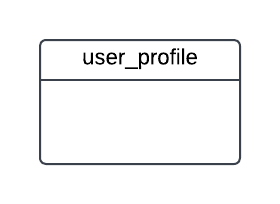
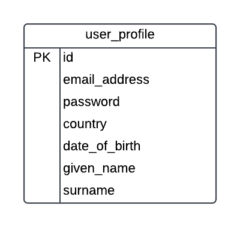
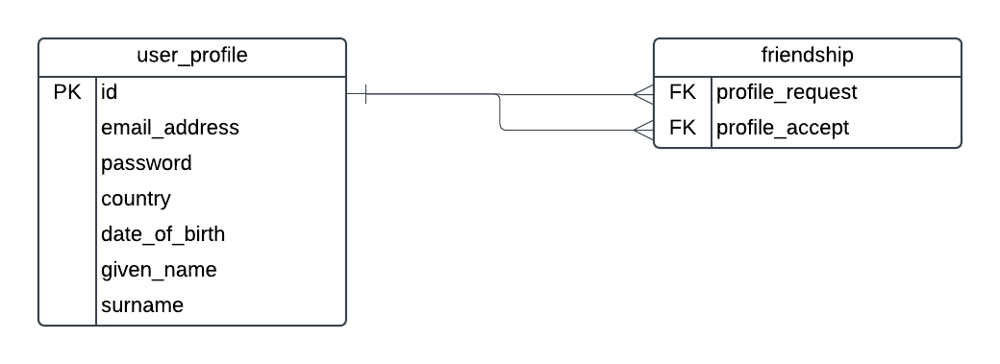
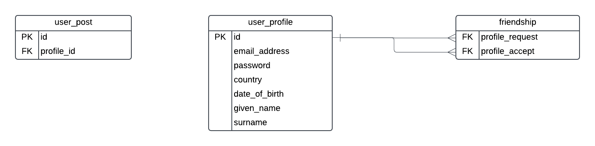
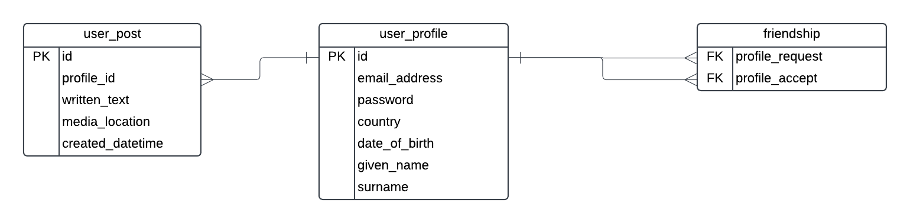
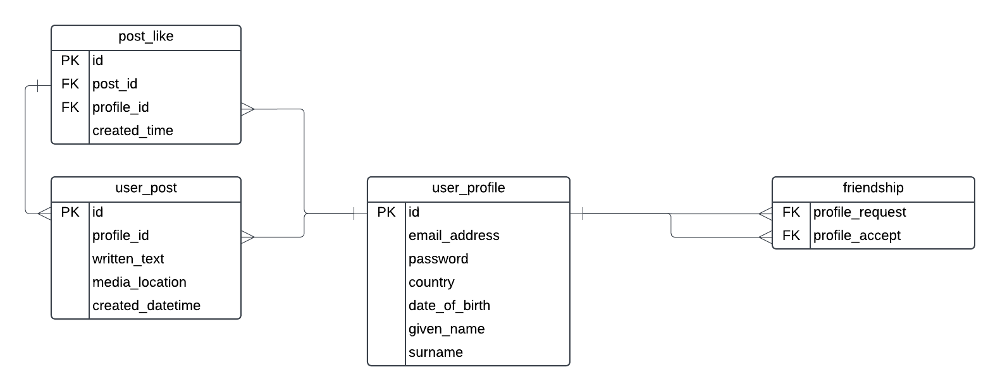
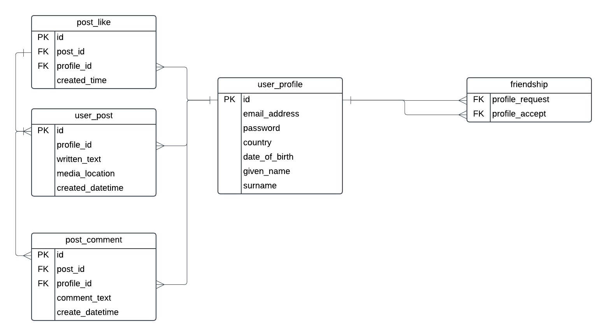

# Social Network - Facebook


| Feature | Description |
|---------|-------------|
| Profile Creation | User signup and profile management |
| Friend System | Connect with other users |
| Post Creation | Share text, photos, and videos |
| News Feed | View friends' posts |
| Engagement | Like and comment on posts |

## Overview
While Facebook is a large and complicated system behind the scenes, for this exercise we will list out some of its features and aim to design a database that could handle them.
Technically we will pretend we're building a website that does something like what facebook does. 

<!-- ## Feature included
### 1. Signup and Create a profile.
### 2. Add Other profiles as friends.
### 3. Add posts that contain text, photos or videos.
### 4. See posts that friends have added.
### 5. Like and comment to posts others have added -->


## Implmentation
When faced with a task like this, one of the ways to approach it is, looking each feature one at a time, creating a design, and making some assumptions along the way.

### 1. Signup and Create a profile

Our first requirement is for users to be able to sign up and create a profile. How would we create a database to allow them to do that.

In order to create a profile, we can assume that a user needs to enter some information. some of this information could be required such as an email address, a password and a name. 
Others maybe optional, like country and date of birth.

So let's first create a table for storing user information, we could call it something simple and obvious like "user". However, "user" is a reserved word in many databases and we try to avoid reserved words 
for table names as it can cause issues running SQL and working with tables.
So what can we call it, we could call it "user_profile" or "user_account" or something similar, let's call it user_profile.



In our newly created "user_profile" table, we add several attributes, which are our columns. The attributes would be those we discussed earlier
email address
password
name
country and 
date of birth

now a good question would be, how do we deal with the name, if you are in a country or culture where first name and a last name are normal, it might make sense to add two columns and have them both mandatory. However this is not always the case, because not everyone has a traditional last name. 

you might want to check  this linke out to learn about common fallacies about names.

[falsehoods programmers believe about names](https://www.kalzumeus.com/2010/06/17/falsehoods-programmers-believe-about-names/)

So, this is one of good examples where you have to make a decision on how to proceed in your case depending on who you are building for. But in this case we are planning to build the next facebook😂 right, So I would suggest having two fields and it's upto you what you call them,but I'll call them given_name and surname.

Now what about a primary key? It's good idea to have a unique way of identifying this record. There are a few ways to do it, but I recommend creating a new column to store a unique ID. we'll call it "id". How about a username? Usernames are common in many websites that allow users to log in. We could add one here, but Facebook doesn't need one to log in as far as i know, and we don't need one for our application. So let's ignore it.



### 2. Add Other profiles as friends.

The next feature is the ability to add other profiles as friends. We can assume that the functionality to search for profiles and find profiles will exist on the application, and we just need to allow the friends to be stored in the database. so how do we do this?. It's good to start by defining what a friendship is, isn't it?. 

Frienship = relationship between two profiles

Now, you may be thinking of ways to implement this and maybe a term "Self Join" may have crossed your mind, so self join allows you to join a record to another record of the same table. This is useful for hierarchical relationships, such as employees and managers where managers are also employees, or product categories and subcategories. However, using a self join relationship will only allow a single friend. This might be a good idea in real world but not so good for our "social" network. so Self join is not suitable for us. 

How about a many-to-many relationship by creating a new joining table. So let's try to add a joining table to our database and call it by the relationship between the two profiles. We'll call it "friendship". If we have other relationship types in the future, we can rename the table, but for now I think friendship is OK.

We add two columns: one for each side of the friendship. We'll call the columns "profile_request" and "profile_accept", as we can assume that one person will request friendship of another. This is a good time to wonder, what if a user declines the request?, Perhaps we don't add the record to the table. Or what if  the other person requests a friendship?, we could add a table constraint, or an application feature, to prevent this from happening. but for now onto the next feature, wait here is what our database looks like.




### 3. Add posts that contain text, photos or videos.

To implement this feature, we assume that a post is owned by a profile or a user, so we can create a table for posts and link it to the user_profile. our new table could be user_post, as the word post may be a reserved word. we add in "id" column for the primary key. We also add in the "profile ID" as a foreign key, and we can call it owner_profile_id, to indicate it's the profile that owns the post.




What about different types of posts? There are a few ways we can do this. We could have separate tables for different types of posts: a text_post, a video_post and image_post table. Or we could have one table with several attributes. Or maybe another way. There are pros and cons to each approach. This is one way we can do it. We'll use a single "user_post" table. We can add a text field to capture any text for the post, for written posts for example. We can also add a media field, which can contain a photo or video. This could be a text value that refers to the URL on the server of the video or photo. It's possible to store files inside the database, inside a BLOB for example. There are pros and cons to this, but to keep it simple, we can assume that the file will be stored on the server and this would be a reference to it. We can also store the date and time that the post was created, so it can be shown in the application or analyzed in the data.



### 4. See posts that friends have added.

We can assume this is a newsfeed or timeline feature, where you can see posts that others have made. This is something that is likely built into the application, where it queries the database to find posts and show them on screen. We don't need to make database changes for this, so let's move to the next feature.


### 5. Like and comment to posts others have added

The last feature is the ability to like or comment on other posts. What is a like? it's an indication that you like a post that someone else has put up. For likes, we need to store a few things. We store the person who liked it and the post that was liked. A user can do this on many posts, but only once per post. So in our database design, we have a new table to store this information. We want to store the "post ID" that was liked, the "user_profile ID" that liked the post. This is a separate table so we can store mulitple likes for a post. If we just added a "user_profile_id" to the "user_post" table, we could only store one ID in that column. In this new table, we can store as many as we want. We can also store a date and time of the like, so we can see when it was liked. 



What about comments? A comment is a text comment that someone makes on another post. You can do this many times on the same post, or on many posts. We would create a new table for this. We'll call it "post_comment". We want to store the "post ID" that is being commented on, the user "profile ID" who makes the comment, the comment_text itself, and the date and time the comment was made.

Here is what our final database design looks like, taking into account the feature we mentioned. It allows for profiles to be created for users, users to be friends with others, users to add posts, like and comment on posts.



### 6. DATA, DATA DATA MY SON IT'S ALL ABOUT THE DATA

what about the data types? The data types for these columns will depend on your database. Generally, there are  are some recommended data types for each attribute, situation and the amount of data you're storing. For example, the comment_text column in the comment table maybe an NVARCHAR column with 100 characters. 

### 7. Sample Queries

Let's take a look at a couple of sample queries that the application may use to find information.


##### 1. find details of your friends

lets assume id = 14 is current user's profile

```SELECT p.given_name, p.surname, p.country
FROM user_profile p
INNER JOIN friendships f ON f.profile_request  = p.id
WHERE f.profile_accept = 14
UNION 
SELECT p.given_name, p.surname, p.country
FROM user_profile p
INNER JOIN friendships f ON f.profile_accept = p.id
WHERE f.profile_request = 14;```

##### 2. All comments on a post 

lets assume id = 31 is a specific post

```SELECT 
c.create_datetime,
c.comment_text,
p.given_name,
p.surname,
FROM user_profile p
INNER JOIN post_comment c ON p.id = c.profile_id
WHERE c.post_id = 31;```

##### 2. All of your text posts

lets assume id = 14 is current user's profile

```SELECT 
c.created_datetime,
c.comment_text
FROM post_comment
WHERE c.profile_id = 14;```


### 8. A challenge for you

What about the other features that are available on facebook and other social media networks, such as liking comments, nested comments, groups or photo albums? We haven't included them here because you will be doing that. That would be a good way to practice your database design skills - adding new features to the database.


## How to Contribute
- Fork this repository.
- Add your improvements or new designs.
- Submit a pull request with a detailed description of your changes.

## Feedback
I welcome feedback, suggestions, and questions! Please open an issue or reach out to me directly.

## License
This project is licensed under the [MIT License](LICENSE).

## Author
[Nardos](https://github.com/Nardos-Tsega) 

[Connect with me on LinkedIn](https://www.linkedin.com/in/nard-tsegaye/)
